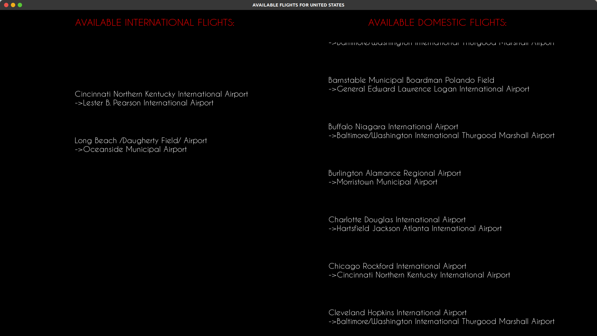
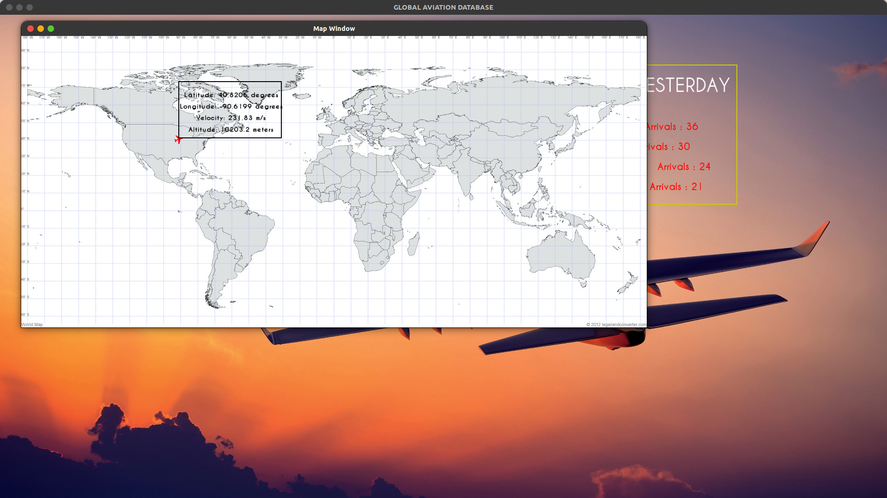
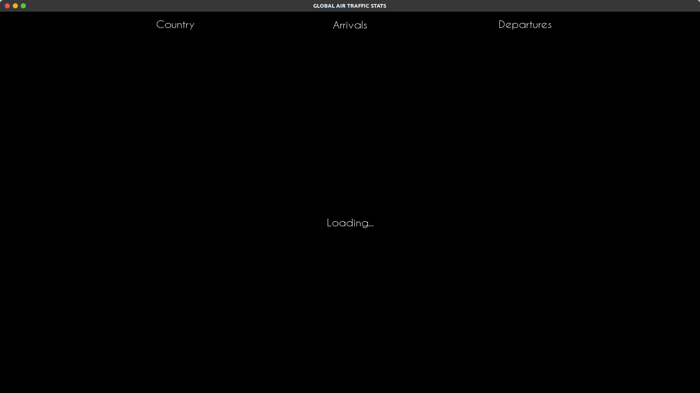
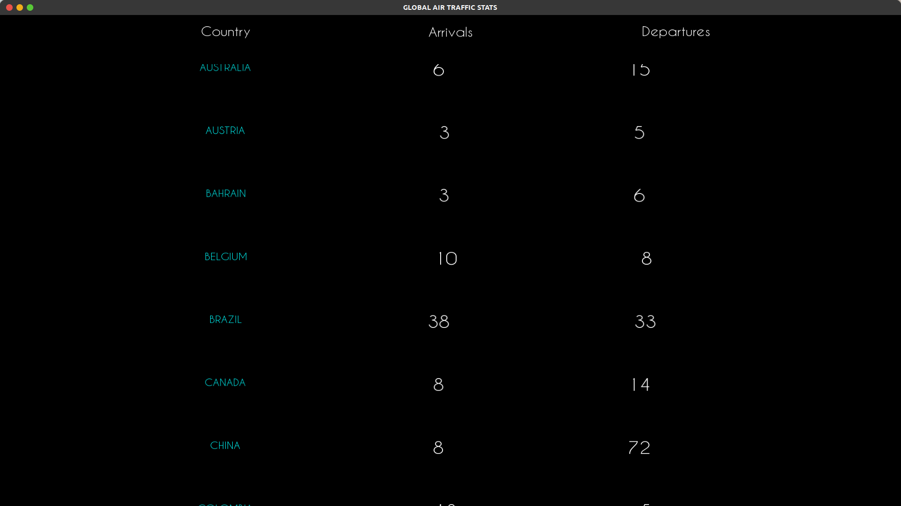

<!-- @format -->

# Global Aviation DataBase

_-Synopsis_

    This our project, on data strutures and algorithms. 
    This project basically shows our fluency and aquintance with concept 
    of various data structures used in programming.

    In our project, we created whole data structures from scratch and used it in usefull way to, 
    display the data parsed from 
    [open-sky](https://opensky-network.org) and display in screen with SMFL library.

## Starting window

Initally, data is fetched from internet via rest [api](https://opensky-network.org) of opensky network
and parsed through our, parsers with jsonxx library.
The parsed data is in format of `BinaryTree_<string, linkedlist_<string>>`

```cpp
/**  Example Parser
   This basically returns the state vector of all the flight on air, in BinaryTree format with key as callsifn of a flight.

*/

auto parse_all_state(string key = "callsign") -> BinaryTree_<string, linkedlist_<string>>
{...}


```


.

After fetching and parsing the result, it display the top five of them here.


---

## Booking Flight from country of departure




---

## Flight Tracking with Callsign




---

## Global Air Traffic




